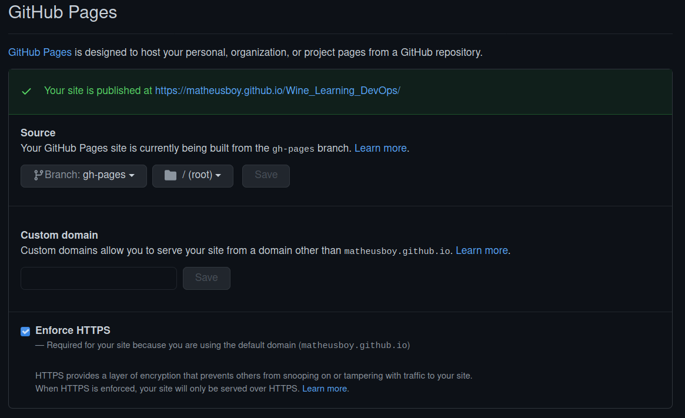

# Making This Documentation
Going around and learning new things is great, but there is no real value to it if we cannot apply it somehow. That being said, this portion of the documentation documents the process of creating this documentation page.

## Learning
### __MkDocs__
We start from the very basics: researching and learning. The first thing done was going to [MkDocs](https://www.mkdocs.org/) documentation page and learning what it was and the basics on how to use it. Quickly learning about MkDocs showed that I did not have a good understanding of what a static site generator was and neither what a static site was. So I started reading some blogs to find the answers like [here](https://techterms.com/definition/staticwebsite), [here](https://en.wikipedia.org/wiki/Static_web_page), [here](https://www.netlify.com/blog/2020/04/14/what-is-a-static-site-generator-and-3-ways-to-find-the-best-one/) and [here](https://idratherbewriting.com/learnapidoc/pubapis_static_site_generators.html).

### __Material__
The next step was to learn a little more on static site generators and for that matter I started learning more about [Material](https://squidfunk.github.io/mkdocs-material/), a nice looking theme for MkDocs. 

### __GitHub Pages__
The final step before trying any implementation was to learn how to host a static webpage. I ended learning about [GitHub Pages](https://pages.github.com/) as it would allow a free and easily deployable way to host this documentation. The integration between Github Pages and GitHub was also a great factor.

## Starting Up
The next step was to get my hands on Material and GitHub Pages and start practising.

### __Material__
To get myself around Material I had to get Material installed. At least that's what I thought. There is an official Docker image for Material so running it was as easy as writing: 

```bash
docker pull squidfunk/mkdocs-material

docker run --rm -it -v ${PWD}:/docs squidfunk mkdocs-material new .
```
Then, I had to get a way to actually see what I was doing in the project. Once again, it was very simple:

```bash
docker run --rm -it -p 8000:8000 -v ${PWD}:/docs squidfunk/mkdocs-material
```
Now I could see what I was doing and could move to the next step.

### __GitHub Pages__
The hardest part so far. Setting the YAML as shown [here](https://squidfunk.github.io/mkdocs-material/publishing-your-site/) to the root of my repository was easy. Understanding how GitHub uses it was not. 

After sometime reading the GitHub Pages documentation and finally understanding how to set it up I got a green check mark and was ready to move.

