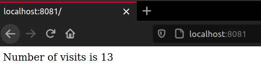
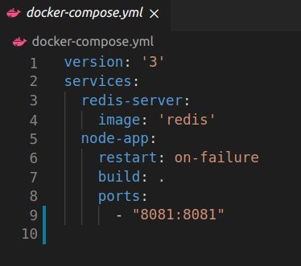
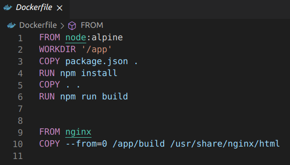

# Course Sections
Here we present an overview of what each section talks about.

## Section 1
	
### **What is Docker**
Introduction to Docker and basics concepts behind the platform.

### **Docker Installation** 
A guide on how to install Docker on most OS out there. Small instructions for Linux in the course, had to resort to the official guide for [Ubuntu installations](https://docs.docker.com/engine/install/ubuntu/).

### **Basic use of Docker Client**
Using commands to check if the installation was correctly done.

```bash
docker version
docker run hello-world
```

## Section 2

### **Containers**
What are containers, how to run them and what running a container truly is.

### **Basic Commands** 
Introduction to useful commands.

```bash
docker ps
docker run
docker system
docker kill
docker start
docker create
docker stop
docker logs
docker exec
...
```

### **Isolated Containers**
Showing that a container is virtually isolated from the running machine and other containers running along side it by default.

## Section 3

### **Creating a Container Image**
Creating a container image using the command **build**.
```bash
docker build 
docker build -t matheusboy/image-tag
```
    
### **Dockerfile**
What is a Dockerfile, how it works and how to make one.


    
### **Base Images**
Using base images to build Docker images.
    
### **The Build Process**
How the building process of an image takes place.
    
### **Manual Image Generation** 
using the **commit** command to manually generate an image.

```bash
docker commit container-id
```
## Section 4

### **JavaScript App**
Writing a simple JS App to work along the section.


### **Application Container**
Building a container for the application from a Dockerfile.

### **Debugging**
Revising common mistakes made during the project creation. 

### **Port Mapping**
How to port map a container.

```bash
docker run -p HostPort:ContainerPort <image-id>
```
## Section 5

### **Visits Counter**
Another project to be used along this section: a simple webpage with a visits counter.



### **Docker Compose**
What is Docker Compose and how to use it. Using Docker Compose to run multiple containers. 

Setting up a Docker Compose YAML file and basic commands.



```bash
docker-compose up
docker-compose down
docker-compose build
docker-compose create
...
```
## Section 6

### **Development Workflow**
How a development workflow works and using it to implementing a React App project.


    
### **Creating a Dockerfile.dev**
To implement the project in the development stage it's used a Dockerfile.dev to differ from the Dockerfile that's going to be used in the production stage.


    
### **Docker Volumes**
How to use volumes in a container. More info [here](https://docs.docker.com/storage/volumes/).

```bash
docker volume
docker run -v $(pwd):<volumedir> <image-id>
```
    
### **Docker Compose Services**
Setting up different services with Docker Compose.

    
### **Multi-step Docker Builds** 
Setting up a production stage Dockerfile with multiple building steps.



## Section 7

### **Using Travis and AWS**
What is Travis and AWS and how to set them up.

### **Travis YAML** 
Creating a basic Travis YAMl file and integrating it to GitHub so pull requests can be automatically tested and deployed into AWS. 


## Section 8

### **React App Project**
Entire section was about writing JavaScript code for a Fibonacci Calculator using React. It will be a multi-container project.

## Section 9

### **Applying Docker Knowledge - Development**
Up to this point the course have presented a great deal of information and most of what have been seen in this section was already seen in past sections. The difference was on **how** what we have seen **can** be used to implement projects, in this case the Fibonacci Calculator. Using Docker Compose to state various services, multi-building process and containers configurations. 

## Section 10

### **Applying Docker Knowledge - Production**
Much like Section 9, in this section our knowledge acquired was applied in order to make the production stage files.