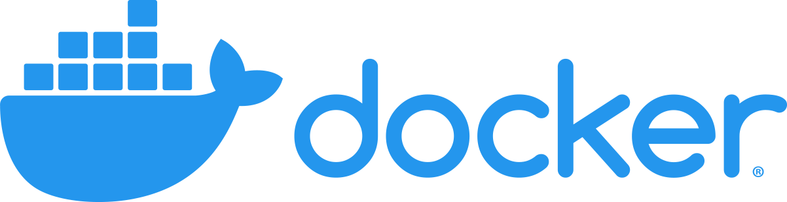
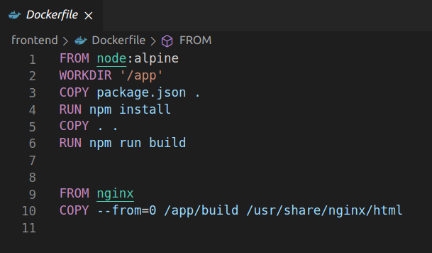
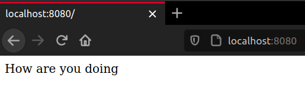
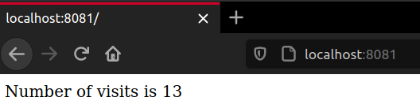
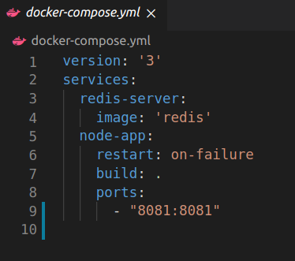
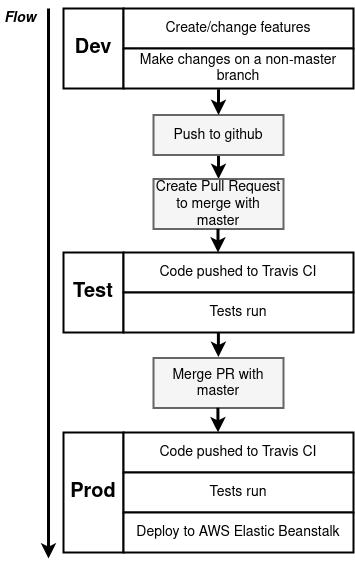
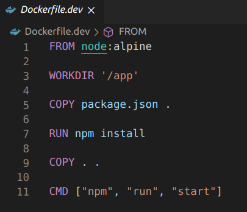
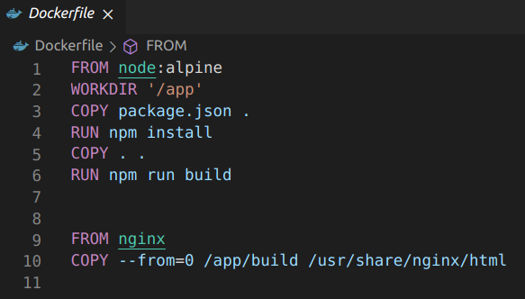
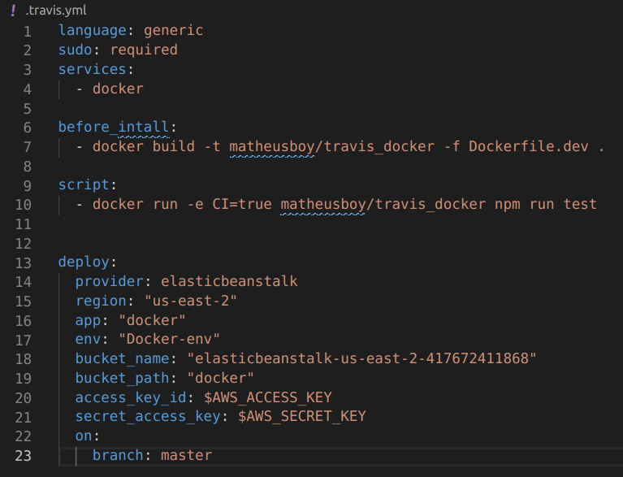

# Course Overview 

## General 

### **What it is**
The Docker course is a Udemy course intended for newcomers in the world of Docker and application containerization. 



Along with Docker the course also teach concepts of CI and how to use AWS and Travis. There is a dedicated Kubernetes portion of the course, but it won't be covered by this documentation as of now.

### **How it works**
Most of the lectures involves following the teacher through a series of commands lines in the terminal. Other times it's required to code along with a code editor. Rarely the lesson will be on another webpage like AWS and the teacher will show how to setup some configurations. 

Most of the instructions are not required to be followed at all and the files are available to download.

To convey real world applications using Docker the course introduces small projects. These projects give a good idea of how DevOps operations and how integration between Travis, GitHub and AWS works. 
### **Why use it**
It's a good introduction to what is Docker and how to use. The lessons are brief, but efficient and they are challenging enough without feeling overwhelming. The series of project helps a lot in understanding the uses od Docker in real world applications.

## Sections

### **Section 1**
	
#### _**What is Docker**_
Introduction to Docker and basics concepts behind the platform.

#### _**Docker Installation**_ 
A guide on how to install Docker on most OS out there. Small instructions for Linux in the course, had to resort to the official guide for [Ubuntu installations](https://docs.docker.com/engine/install/ubuntu/).

#### _**Basic use of Docker Client**_
Using commands to check if the installation was correctly done.

```bash
docker version
docker run hello-world
```

### **Section 2**

#### _**Containers**_
What are containers, how to run them and what running a container truly is.

#### _**Basic Commands**_ 
Introduction to useful commands.

```bash
docker ps
docker run
docker system
docker kill
docker start
docker create
docker stop
docker logs
docker exec
...
```

#### _**Isolated Containers**_
Showing that a container is virtually isolated from the running machine and other containers running along side it by default.

### **Section 3**

#### _**Creating a Container Image**_
Creating a container image using the command _**build**_.
```bash
docker build 
docker build -t matheusboy/image-tag
```
    
#### _**Dockerfile**_
What is a Dockerfile, how it works and how to make one.


    
#### _**Base Images**_
Using base images to build Docker images.
    
#### _**The Build Process**_
How the building process of an image takes place.
    
#### _**Manual Image Generation**_ 
using the _**commit**_ command to manually generate an image.

```bash
docker commit container-id
```
### **Section 4**

#### _**JavaScript App**_
Writing a simple JS App to work along the section.



#### _**Application Container**_
Building a container for the application from a Dockerfile.

#### _**Debugging**_
Revising common mistakes made during the project creation. 

#### _**Port Mapping**_
How to port map a container.

```bash
docker run -p HostPort:ContainerPort <image-id>
```
### **Section 5**

#### _**Visits Counter**_
Another project to be used along this section: a simple webpage with a visits counter.



#### _**Docker Compose**_
What is Docker Compose and how to use it. Using Docker Compose to run multiple containers. 

Setting up a Docker Compose YAML file and basic commands.



```bash
docker-compose up
docker-compose down
docker-compose build
docker-compose create
...
```
### **Section 6**

#### _**Development Workflow**_
How a development workflow works and using it to implementing a React App project.


    
#### _**Creating a Dockerfile.dev**_
To implement the project in the development stage it's used a Dockerfile.dev to differ from the Dockerfile that's going to be used in the production stage.


    
#### _**Docker Volumes**_
How to use volumes in a container. More info [here](https://docs.docker.com/storage/volumes/).

```bash
docker volume
docker run -v $(pwd):<volumedir> <image-id>
```
    
#### _**Docker Compose Services**_
Setting up different services with Docker Compose.

    
#### _**Multi-step Docker Builds**_ 
Setting up a production stage Dockerfile with multiple building steps.



### **Section 7**

#### _**Using Travis and AWS**_
What is Travis and AWS and how to set them up.

#### _**Travis YAML**_ 
Creating a basic Travis YAMl file and integrating it to GitHub so pull requests can be automatically tested and deployed into AWS. 




### **Section 8**

#### _**React App Project**_
Entire section was about writing JavaScript code for a Fibonacci Calculator using React. It will be a multi-container project.

### **Section 9**

#### _**Applying Docker Knowledge - Development**_
Up to this point the course have presented a great deal of information and most of what have been seen in this section was already seen in past sections. The difference was on **how** what we have seen **can** be used to implement projects, in this case the Fibonacci Calculator. Using Docker Compose to state various services, multi-building process and containers configurations. 

### **Section 10**

#### _**Applying Docker Knowledge - Production**_
Much like Section 9, in this section our knowledge acquired was applied in order to make the production stage files.