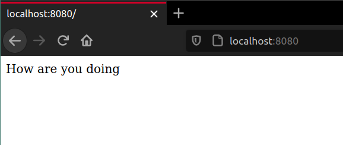

# Section 4

## JavaScript App
Writing a simple JS App to work along the section.



## Application Container
Building a container for the application from a Dockerfile.

## Debugging
Revising common mistakes made during the project creation. 

## Port Mapping
How to port map a container.

```bash
docker run -p HostPort:ContainerPort container-id
```

