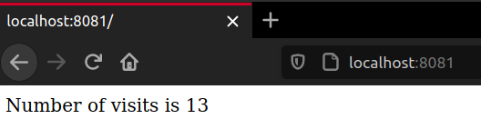

# Section 5

## Visits Counter
Another project to be used along this section: a simple webpage with a visits counter.



## Docker Compose
What is Docker Compose and how to use it. 

Setting up a Docker Compose YAML file and basic commands.


```bash
docker-compose up
docker-compose down
docker-compose build
docker-compose create
...
```


