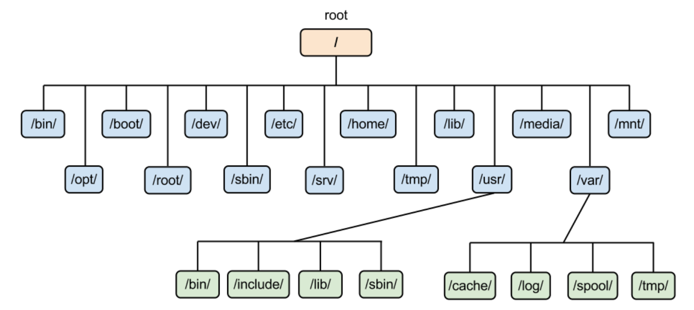
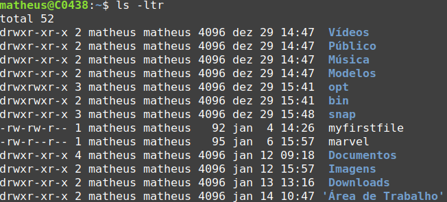
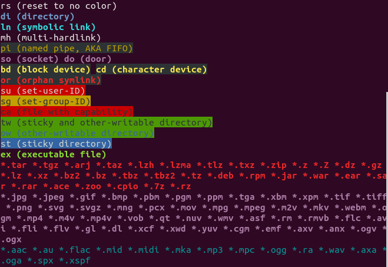

# Course Sections
Here we present an overview of what each section talks about.

## Section 1
	
### **UNIX and Linux History**
Since this course might be someones first encounter with Linux it starts off teaching more about Linux and UNIX. It goes back in time and show how UNIX and Linux came to be.

### **Basic OS Concepts**
General idea of what an OS is, it's attributions and it's key components.

## Section 2

### **Virtual Machines**
What is a Virtual Machine, how it functions and how to set one up running Linux.

### **Linux vs Windows**
Main differences between most Linux distributions and Windows.

### **Linux Distributions**
What are Linux distributions and some examples of the most important and well known ones.


## Section 3

### **Using a Command Prompt**
How to use a command prompt, general command prompt line interface and how to regain control of the prompt in case you lose it (_**ctrl+c**_).

### **Remote Access**
How remote access of a Linux machine works and a easy use to do it using PuTTY.

### **Network Commands**
It is presented two network commands in this section.

#### **_ip_ Command**

The _**ip**_ command is used to show and manipulate routing, network devices, interfaces and tunnels.

```bash
ip 
ip route [command]
```
#### **_ifconfig_ Command**

The _**ifconfig**_ command is used to configure a network interface.

```bash
ifconfig 
ifconfig up
```

### **Important Facts**
Linux has some very specific characteristics: 

* There is a super user in Linux known as _**root**_ that can modify, create and delete accounts and configuration files;
* Linux is a case-sensitive system;
* It might have some problems with files that have space in their name. 

### **Changing Passwords**
To change an user password the _**passwd**_ command.

#### **_passwd_ Command**

```bash
passwd [options] [user-id]
```

### **Linux File System**
Linux has a way in which it structures its files. It is shown below.



### **Files Navigation**
The most used commands for file navigation are _**ls**_, _**cd**_ and _**pwd**_. 

#### **_ls_ Command**
The _**ls**_ command list all the contents within a directory.

```bash
ls
ls -la [dir]
ls -ltr [file]
```
#### **_cd_ Command**
The _**cd**_ command change the working directory of the shell.

```bash
cd ..
cd ~/Desktop/
cd [dir]
```
#### **_pwd_ Command**
The _**pwd**_ command the current working directory of the shell. 

```bash
pwd
```

### **Absolute and Relative Paths**
A absolute path starts with **/** and refers to the root directory.

```bash
cd /var/log/httpd
```
A relative path reference a location relative to the current position.

```bash
cd /var
cd log
cd httpd
```

### **Directory Listing Attributes**
When using the command _**ls**_ we can see some information of the files listed.



The first column shows the filetype and permissions. The second shows the number of hard links to that file. Then comes the owner and the group associated with that file. The fifth column shows the size in bytes. The last two portions tell the date of the last modification to that file and the files name.

### **Creating Files and Directories**
#### **_touch_ Command**
The _**touch**_ command can be used to create an empty file.

```bash
touch [file]
```

#### **_cp_ Command**
The _**cp**_ command copies files and directories.

```bash
cp [original-file] [/otherdir/copied-file]
cp [original-dir] [copied-dir]
```

#### **_vi_ Command**
The _**vi**_ command starts up the _**vi**_ or _**vim**_ text editor.

```bash
vi
vi [file]
```

#### **_mkdir_ Command**
The _**mkdir**_ creates a directory.

```bash
mkdir [dir]
```

### **Finding Files and Directories**
To search for a file or directory we can use the _**find**_ command or the _**locate**_ command.

#### **_find_ Command**
The _**find**_ command searches for files and directories that have a specific expression in their name in a directory hierarchy.

```bash
find log
```
#### **_locate_ Command**
The _**locate**_ command searches for files and directories that have a specific expression in their name in a database it keeps. Since it doesn't have to search the whole system it's faster than using _**find**_, but requires to periodically updates its database using the _**updatedb**_ command.

```bash
sudo updatedb
locate log
```

### **Wildcards**
The command prompt works with some wildcards to make easier manipulating files. Some wildcards are:

* _*****_: represents zero or more characters;
* _**?**_: represents a single character;
* _**{ }**_: represents a range of characters.

```bash
touch abc-{1..9}
rm abc-?
touch abc-{1..9}
rm ab*  
```

### **Hard and Soft Links**
hard links are related directly to the file inode so it will still link to the file even if the original file is deleted. A soft link is related to the file linked to the inode, so it will be lost if the file is deleted. Links can be created using the _**ln**_ command. Soft links require the _**-s**_ option.

#### **_ln_ command**

```bash
ln [file] [link-name]
ln -s [file] [link-name]
```

### **Filesystem Color Definition**
Linux have a color scheme to help clearly identify files and directories in the command prompt.



## Section 4

### **Standard Command Line Syntax**
We have used commands a few times so far, but have never really seen how a command syntax really is. Below is presented said syntax.

```bash
command [options] [argument]
```
    
### **Files Permission**
Every file has 3 levels: user (_**u**_), group (_**g**_) and others (_**o**_). To each level can have up to 3 types of permission: read (_**r**_), write (_**w**_) and execute (_**x**_). To change a permission the _**chmod**_ command is used.

#### **_chmod_ command**

```bash
chmod u+x [file]
chmod 754 [file]
```
    
### **File Ownership**
Every file or directory is attached to two types of ownership: user and group ownership. To change these ownerships we use _**chown**_ and _**chgrp**_.

#### **_chmown_ command**

```bash
chown [user] [file]
```
#### **_chmgrp_ command**

```bash
chgrp [group] [file]
```
    
### **Help Commands**
Most of the time it's faster to search for help within the command prompt. The main commands for that are _**man**_ and _**whatis**_. The _**--help**_ option is also a great way to do it.

#### **_man_ command**
It shows a interface for the system manual concerning some command or program. 

```bash
man [command]
man [program]
```

#### **_whatis_ command**
It shows some lines of the manual for a given command or program. 

```bash
whatis [command]
whatis [program]
```   

#### **_--help_ option**
Most commands and programs have a _**--help**_ option that show some information about it.

```bash
[command] --help
[program] --help
```

### **The Up Arrow and Tab keys**
On the command prompt we can use the _**up arrow key**_ as a shortcut to reenter our last commands. The _**tab**_ key will automatically complete the available command, file or directory.
    
### **Adding Text to Files**
There are a few ways to add text to a file. We can use _**vi**_ as we have seem before. We can also redirect the output of a command to a file using _**\>**_ or _**\>\>**_. Using _**\>**_ will clear the file and add the command output to it, while _**\>\>**_ will append the output to a new line in the file. 

```bash
touch file
vi file
echo "hello" > file
echo "there" >> file
```

### **Standard Output to a File**
There is a special command called _**tee**_ that allows us to store and view the output of a command at the same time.

#### **_tee_ command** 

```bash
touch file
echo "hello there" | tee file
```
    
### **Pipes**
A pipe (**|**) is used by the shell to connect the output of a command to the input of another one.

```bash
[command1] [argument] | [command2] [argument]
```
    
### **File Maintenance Commands** 
Most of the usual file maintenance commands we have seen so far (_**cp**_, _**mkdir**_, , _**chgrp**_, _**chown**_, etc). We will focus now on the _**rm**_, _**mv**_ and _**rmdir**_ commands.

#### **_rm_ command** 
This command is used to remove files or directories from the system. It's important to notice that this action is irreversible so it need to be used very carefully. 

```bash
touch file
rm file
rm -r [dir]
```

#### **_mv_ command** 
This command moves files and directories to new locations. Moving a file or directory to the same location it's a way to change its name. 

```bash
touch file
mv file [dir]
mv file ./[new-file-name]
```

#### **_rmdir_ command** 
This command is used to remove directories from the system. It's important to notice that this action is irreversible so it need to be used very carefully. 

```bash
mkdir dir
rmdir dir
```

### **File Display Commands**
There are a few way in which we can display information in the command prompt. We can use _**ls**_ to list files and directories or _**echo**_ to echo a message in the prompt. To see a file content we use _**cat**_.

#### **_cat_ command**
```bash
touch file
echo "hello there" > file
cat file
```
    
We can also use some filters (_**more**_, _**less**_, _**head**_, _**tail**_, etc) to better the display presentation in the prompt.

### **Filter and Text Processing Commands**
To better work with text we can use some commands (_**cut**_, _**awk**_, _**grep**_, _**egrep**_, _**sort**_, _**uniq**_, _**wc**_, etc) that allow us to process and filter text display.

#### **_cut_ command**
Used to remove sections form each line of files.
```bash
touch file
echo "hello there" > file
cut -c2 file
```

#### **_awk_ command**
Used data extraction.
```bash
touch file
echo "hello there" > file
awk '/hello/ {print}' file
```
    
#### **_grep_ and _egrep_ commands**
Print the lines of a file with a specified pattern.
```bash
touch file
echo "hello there" > file
echo "ah, general Kenobi" >> file
grep "Kenobi" file
egrep -i "hello|Kenobi" file
```    

#### **_sort_ command**
Used to sort in alphabetical order.
```bash
touch file
echo "hello there" > file
echo "ah, general Kenobi" >> file
sort file
```

#### **_uniq_ command**
Used to remove duplicates.
```bash
touch file
echo "hello there" > file
echo "hello there" >> file
echo "ah, general Kenobi" >> file
uniq file
```

#### **_wc_ command**
Used to count the number of words, new lines and bytes.
```bash
touch file
echo "hello there" > file
echo "ah, general Kenobi" >> file
wc file
```

### **Comparing Files**
The main commands used to compare files are _**diff**_ and _**cmp**_.

#### **_diff_ command**
Used to compare files line by line.
```bash
touch file1
echo "hello there" > file1
touch file2
echo "ah, general Kenobi" > file2
diff file1 file2
```

#### **_cmp_ command**
Used to compare files byte by byte.
```bash
touch file1
echo "hello there" > file1
touch file2
echo "ah, general Kenobi" > file2
cmp file1 file2
```
    
### **Compressing and Decompressing Files**
To compress and decompress files the mainly used commands are _**tar**_, _**gzip**_ and _**gunzip**_.

#### **_tar_ command**
Used to archive multiple files or to separate them from a given archive.
```bash
touch file1
echo "hello there" > file1
touch file2
echo "ah, general Kenobi" > file2
tar -cf archive.tar file1 file2
```
    
#### **_gzip_ command**
Used to compress or decompress files.
```bash
touch file1
echo "hello there" > file1
touch file2
echo "ah, general Kenobi" > file2
tar -cf archive.tar file1 file2
gzip archive.tar
```

#### **_gunzip_ command**
Used to decompress files.
```bash
touch file1
echo "hello there" > file1
touch file2
echo "ah, general Kenobi" > file2
tar -cf archive.tar file1 file2
gzip archive.tar
gunzip archive.tar.gz
``` 

### **Truncating Files**
We can use the _**truncate**_ command to truncate a file to an specified size. Note that if the files is larger than the specified size the command will chop out the excess. Should be carefully used.

#### **_truncate_ command**
Used to compress or decompress files.
```bash
touch file
echo "hello there" > file
truncate -s 2 file
``` 
    
### **Combining and Splitting Files**
To combine multiple files we can use the _**cat**_ command and redirect its output to a file. To split a file we use the _**split**_ command.

#### **_split_ command**
```bash
cat file1 file2 file3 > file4
split file4
``` 

### **Comparing Linux and Windows Commands**
While in Linux the use of the terminal is a common thing, Windows also have a command prompt for command lines. Most of the commands used in Linux have counterparts on Windows. A detailed list of such commands can be found [here](https://www.geeksforgeeks.org/linux-vs-windows-commands/).